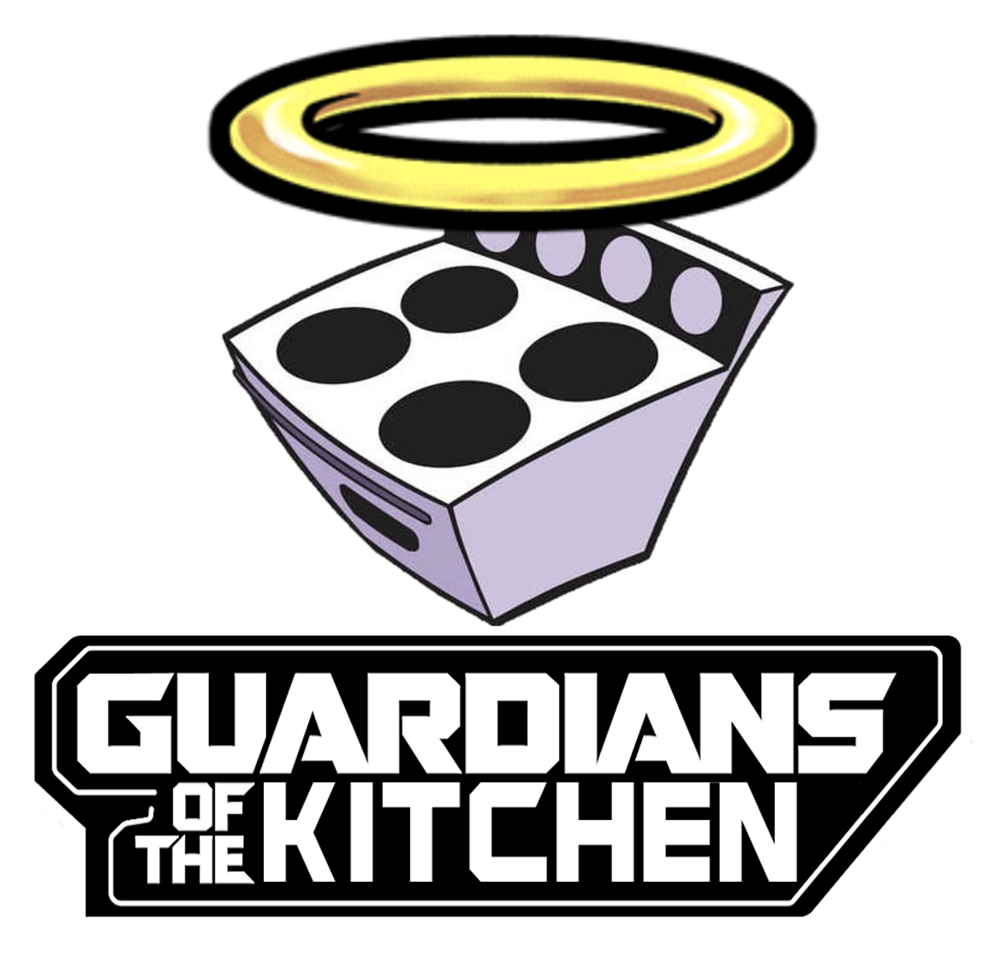

<!-- BANNER -->

 

# **Introduction**
Kitchen Guard, developed by The Guardians of the Kitchen (Group 2), is a system designed to enhance kitchen safety by monitoring stove activity and notifying users if the stove is left unattended. The system utilizes a Raspberry Pi 5, motion sensors, contact sensors, and smart lighting to detect user presence and stove status. If the stove is left on for an extended period without user activity, the system sends notifications through blinking lights and can automatically turn off the stove to prevent accidents.

# **Table of contents**

* [Introduction](#introduction)
* [Features](#features)
* [Hardware Components](#hardware-components)
* [Installation Guide](INSTALL.md)
* [Architecture Overview](#architecture-overview)
* [Testing Strategy](#testing-strategy)
* [GOTK PHP Server](#gotk-php-server)
* [License](LICENSE)
* [Support](#support)

# **Features**

The Kitchen Guard system offers several key features to ensure user safety and convenience:

* Monitors stove activity and user presence.
* Sends notifications if the stove is unattended for more than 15 minutes.
* Automatically turns off the stove after 20 minutes away from kitchen.
* Uses smart lighting for visual alerts in all rooms.
* Uses Zigbee communication for reliable sensor interaction.

# **Hardware Components**

The system is built using the following hardware components:

* **Raspberry Pi 5**: Runs all system logic and coordinates all components.
* **RTCGQ11LM and RTCGQ14LM Aqara Motion Sensors**: Detect user presence in all rooms.
* **07048L Immax Neo Smart Plug**: Monitors and controls the stove's power state.
* **LED1836G9 Ikea TRÅDFRI**: Provides visual alerts through smart lighting.
* **ZBDongle-P Sonoff Zigbee 3.0 USB Dongle Plus**: Enables communication between the Raspberry Pi and Zigbee devices.

# **Architecture Overview**

The system follows a model-view-controller architecture, integrating various hardware components with the control logic running on the Raspberry Pi. Zigbee2MQTT is used for communication between the devices, ensuring stable and efficient operation.

For more information, refer to the Architectural Design Specification.

# **Testing Strategy**

The testing process includes unit tests, integration tests, and acceptance tests. The focus is on ensuring that the system meets all specified requirements and functions reliably under different scenarios based on previously specified use cases.

For more information, refer to the Test Specification Document.

# **GOTK PHP Server**

The Kitchen Guard system also relies on a PHP-based server for database interactions. You can find the source code and setup instructions for the PHP server in the [GOTKPHPServer Repository](https://github.com/Losmobilos3/GOTKPHPServer).

# **Support**

For any questions or support, please open an issue on GitHub or contact us directly. 

Project Manager: Daniel Østerballe, 202205835@post.au.dk
